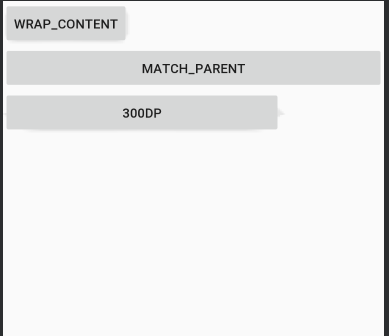

## 뷰(View), 뷰그룹(ViewGroup)


UI의 구성요소, 즉 사용자의 눈에 보이는 화면의 구성요소들을 **뷰(View)** 라고 한다. 예를 들어 텍스트뷰, 버튼, 이미지뷰 등등이 있다.
뷰 중에서 일반적인 컨트롤의 역할을 하는 것을 **위젯(Widget)** 이라고 한다.

이러한 뷰를 여러 개 포함하고 있는 것을 **뷰그룹(ViewGroup)** 이라고 한다. 뷰그룹은 뷰를 상속하고 있어서 하나의 뷰 처람 다룰 수 있도록 만들어져 있다.
뷰그룹 중에서 내부에 뷰들을 포함하고 있으면서 그것들을 배치하는 역할을 하는 것을 **레이아웃(Layout)** 이라고 한다.

## 뷰의 속성

#### 뷰의 크기

뷰의 크기를 결정짓는 속성으로는 대표적으로 두가지가 있다.

* `android:layout_width` : 뷰의 너비 
* `android:layout_height` : 뷰의 높이

뷰의 너비와 높이 속성값으로는 다음 세가지 중 하나가 들어갈 수 있다. 
* `wrap_content` : 뷰 안의 내용물의 크기에 맞춤
* `match_parent` : 뷰를 담고있는 뷰 그룹의 여유공간에 꽉 채움
* 숫자로 크기 지정. `dp`, `px`등의 단위가 있다.

세가지 버튼을 추가해서, `layout_width` 속성을 각각 다르게 설정하면 다음과 같이 된다.
```xml
<LinearLayout
...
>
    <Button
        android:layout_width="wrap_content"
        android:layout_height="wrap_content"
        android:text="wrap_content" />

    <Button
        android:layout_width="match_parent"
        android:layout_height="wrap_content"
        android:text="match_parent" />

    <Button
        android:layout_width="300dp"
        android:layout_height="wrap_content"
        android:text="300dp" />
</LinearLayout>
```


