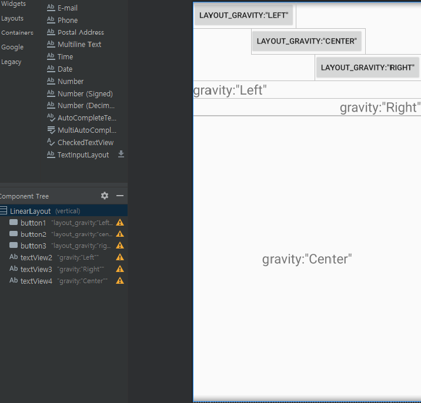

### 레이아웃

레이아웃(Layout) : 안드로이드 앱에서 화면에 보이는 요소(Button, TextView 등등)를 뷰(View)라고 하고, 여러 뷰들을 포함하고 배치하는 역할을 하는 것을 레이아웃이라고 부른다.
<br>안드로이드가 기본적으로 제공하는 레이아웃들은 종류별로 기능이 다르기 때문에 용도에 맞게 사용하여야 한다.

안드로이드에서 제공하는 5가지 대표적인 레이아웃이다.

- 제약 레이아웃(ConstraintLayout) : 제약 조건을 사용하여 화면을 구성. 안드로이드 스튜디오에서 자동으로 설정하는 디폴트 레이아웃
- 리니어 레이아웃(LinearLayout) : 한 쪽 방향으로 차례대로 뷰를 추가하여 화면을 구성
- 상대 레이아웃(RelativeLayout) : 부모 컨테이너나 다른 뷰와의 상대적 위치로 화면을 구성
- 프레임 레이아웃(FrameLayout) : 가장 상위에 있는 하나의 뷰 또는 뷰그룹만 보여주는 방법. 여러개의 뷰를 중첩한 후 각 뷰를 전환하여 보여주는 방식으로 자주 사용함.
- 테이블 레이아웃(TableLayout) : 격자 모양의 배열을 사용하여 화면을 구성하는 방법


### 제약 레이아웃

제약 레이아웃은 뷰의 크기와 위치를 결정할 때 제약 조건(Constraint)을 사용한다. 제약 조건이란 뷰가 레이아웃 안의 다른 요소와 어떻게 연결되는지 알려주는 것으로, 다른 요소들과 연결선을 통하여 만들 수 있다.

activity_main.xml 파일에서 ConstraintLayout에 Button을 추가한 직후, 다음과 같은 메세지를 볼 수 있다.


제약 조건을 설정하지 않는다면, 앱 실행 시에 (0,0)의 위치로 이동이 된다고 한다. 실제로 앱을 실행시 다음과 같이 버튼의 위치가 이동한 것을 볼 수 있다.


제약 레이아웃에서는 뷰의 위치를 결정할수 있을 만큼의 연결선이 필요하다. 예를 들어, 버튼의 왼쪽만 부모 레이아웃에 연결하게 되면, 위아래의 위치를 결정할 수 없기 때문에, 경고메세지가 뜨게 된다. 뷰의 위치를 결정해주기 위해서 다음과 같이 설정해주면 된다.


두개의 버튼을 추가하고, Button1의 모든 가로축과 세로축을 부모 레이아웃과 연결해줘서 화면 중앙에 배치하였고, Button2의 위쪽과 왼쪽을 부모레이아웃과 연결해주고, 마진을 50dp로 설정해줘서 화면 왼쪽 상단에 위치한 것을 확인할 수 있다.


### 리니어 레이아웃(LinearLayout)

리니어 레이아웃은 수평 또는 수직방향으로 뷰를 배치할 수 있다. 아래와 같이 `android:orientation` 속성을 통하여 수평방향은 `horizontal`, 수직방향은 `vertical`값으로 설정한다.

```xml
<!--수평 LinearLayout -->
<LinearLayout 
    ...
    android:orientation="horizontal"
>
```
```xml
<!--수직 LinearLayout -->
<LinearLayout 
    ...
    android:orientation="vertical"
>
```

리니어 레이아웃에 3개의 버튼을 추가한 후 `orientation` 속성을 `horizontal`, `vertical`로 변경했을때 다음과 같이 된다. 


#### 뷰 정렬하기
리니어 레이아웃에서 뷰를 정렬하기 위해서 `gravity` 또는 `layout_gravity`속성을 사용할 수 있다.

- `gravity` : 뷰 안에 표시하는 내용물을 정렬<br>
- `layout_gravity` : 부모 컨테이너의 여유공간 내에서 뷰 정렬





리니어 레이아웃에 버튼과 텍스트 뷰를 추가한 후, 버튼에는 `layout_gravity` 속성을, 텍스트뷰에는 `gravity`속성을 지정하였다.
<br>`layout_gravity`속성을 지정한 버튼들은 화면에서 각각 왼쪽, 중간, 오른쪽에 정렬되었고, `gravity`속성을 지정한 텍스트뷰 들의 내용인 글자들이 각각 왼쪽, 오른쪽, 중간에 정렬되있는 것을 확인할 수 있다.


### 상대 레이아웃(RelativeLayout)

상대 레이아웃은 부모 컨테이너나 다른 뷰와의 상대적인 위치를 이용해 뷰의 위치를 결정할 수 있다.
<br>다른 뷰의 `id` 속성 값을 이용하여 위치를 결정한다.

 |속성|설명|
|------|---|
|layout_alignParentTop|true인 경우 뷰의 위쪽과 부모의 위쪽을 맞춤|
|layout_alignParentBottom|true인 경우 뷰의 아래쪽과 부모의 아래쪽을 맞춤|
|layout_alignParentleft|true인 경우 뷰의 왼쪽과 부모의 왼쪽을 맞춤|
|layout_alignParentRight|true인 경우 뷰의 오른쪽과 부모의 오른쪽을 맞춤|

 |속성|설명|
|------|---|
|layout_above|지정한 뷰의 위쪽에 배치|
|layout_below|지정한 뷰의 아래쪽에 배치|
|layout_toLeftOf|지정한 뷰의 왼쪽에 배치|
|layout_toRightOf|지정한 뷰의 오른쪽에 배치|


이 외에 다른 속성 값들은 안드로이드 공식문서 링크에서 확인할 수 있다.
<br>[안드로이드 공식문서 - RelativeLayout.Layoutparams](https://developer.android.com/reference/android/widget/RelativeLayout.LayoutParams?hl=ko)

### 테이블 레이아웃(TableLayout)

테이블 레이아웃은 격자 모양의 배열로 화면을 구성하는, 쉽게 말해서 표 모양의 레이아웃 이다.

테이블 레이아웃을 추가하게 되면, TableRow 태그가 자동으로 추가되어 있는데, TableRow안에 여러개의 뷰를 추가할 수 있다.

TableLayout에 TableRow의 개수가 행의 개수가 되고, 각 TableRow에 들어있는 뷰의 개수가 열의 개수가 된다. 


위의 그림은 TableLayout을 추가한 후, 세개의 TableRow에 버튼을 각각 두개씩 추가하여 3행 2열의 레이아웃을 구성하였다.

### 프레임 레이아웃(FrameLayout)


