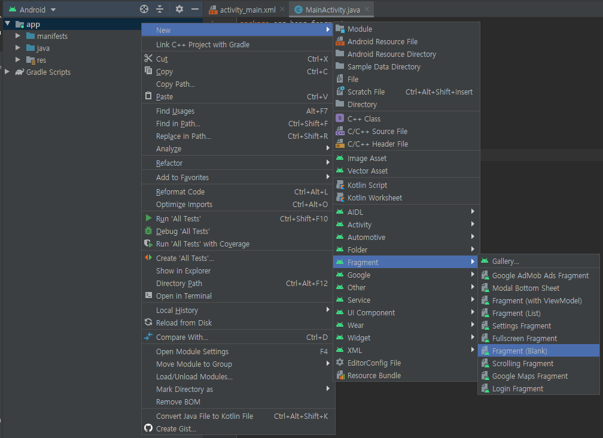
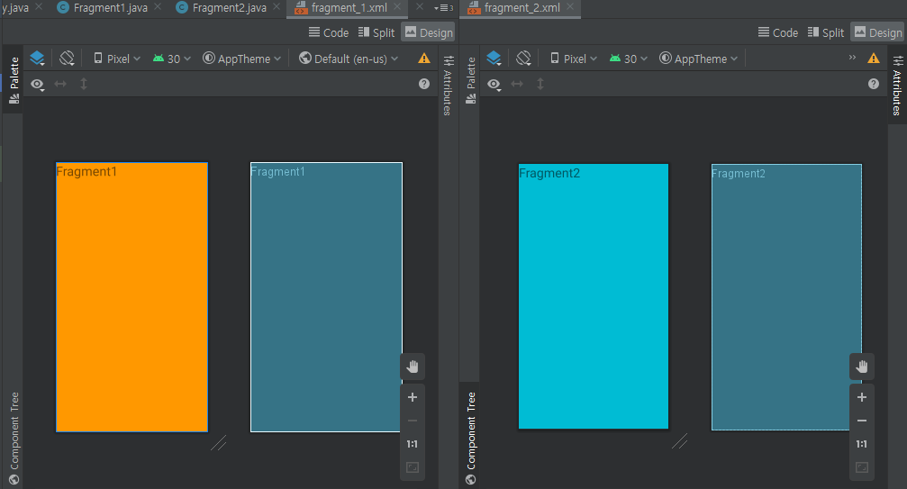
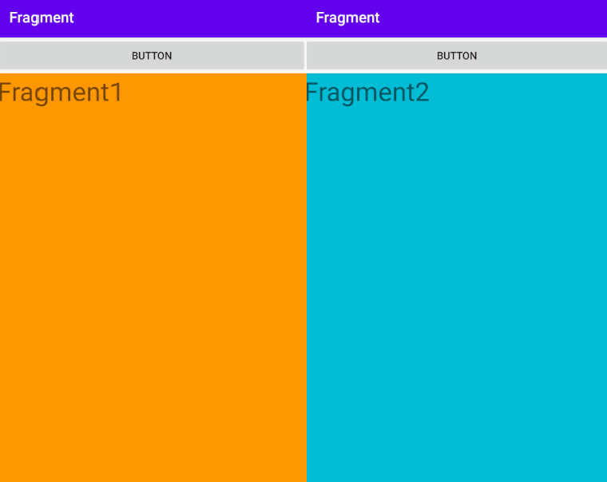

### 프래그먼트(Fragment)

프래그그먼트는 ....

> 태블릿에서 앱을 실행하는 경우, 앱 내의 액티비티A 안에 두개의 포함할 수 있습니다. 그러나 일반 스마트폰의 화면은 두 프래그먼트를 모두 쓸 만큼 공간이 충분하지 않기 때문에, 액티비티 A에는 기사목록에 해당되는 프래그먼트만 포함되고, 사용자가 기사를 하나 선택하면 액티비티 B가 시작됩니다. [출처-안드로이드 공식문서](https://developer.android.com/guide/components/fragments#Design)

 

### 프래그먼트 화면에 추가하기

`getSupportFragmentManager().beginTransaction().replace(Layout_id, fragment).commit();`


프래그먼트를 두개 추가해서 화면을 전환하는 예제.


우선, `App` 에서 오른쪽 클릭 후 `New`->`Fragment`->`Fragment(Blank)`를 선택한 다음, `Fragment1`, `Fragment2`를 추가해준다.


그다음, `Fragment1.java`, `Fragment2.java`파일을 열어 다음과 같이 수정한다. 

```java
public class Fragment1 extends Fragment {

    @Override
    public View onCreateView(LayoutInflater inflater, ViewGroup container, Bundle savedInstanceState) {
        return inflater.inflate(R.layout.fragment_1, container, false);
    }
}
```
```java
public class Fragment2 extends Fragment {

    @Override
    public View onCreateView(LayoutInflater inflater, ViewGroup container, Bundle savedInstanceState) {
        return inflater.inflate(R.layout.fragment_2, container, false);
    }
}
```

다음에는 `app/res/layout`폴더에서 `fragment_1.xml`, `fragment_2.xml` 파일을 열어, 프래그먼트 화면을 설정해준다.

```xml
<FrameLayout xmlns:android="http://schemas.android.com/apk/res/android"
    xmlns:tools="http://schemas.android.com/tools"
    android:layout_width="match_parent"
    android:layout_height="match_parent"
    android:background="#FF9800"
    tools:context=".Fragment1">

    <TextView
        android:layout_width="match_parent"
        android:layout_height="match_parent"
        android:text="Fragment1"
        android:textSize="35sp" />

</FrameLayout>
```

```xml

<FrameLayout xmlns:android="http://schemas.android.com/apk/res/android"
    xmlns:tools="http://schemas.android.com/tools"
    android:layout_width="match_parent"
    android:layout_height="match_parent"
    android:background="#00BCD4"
    tools:context=".Fragment2">

    <TextView
        android:layout_width="match_parent"
        android:layout_height="match_parent"
        android:text="Fragment2"
        android:textSize="35sp" />

</FrameLayout>

```



<br>

`app/res/layout/activity_main.xml` 파일에서 화면 전환버튼과, 프래그먼트가 들어갈 **FrameLayout**을 추가해준다.

```xml
<LinearLayout xmlns:android="http://schemas.android.com/apk/res/android"
    xmlns:app="http://schemas.android.com/apk/res-auto"
    xmlns:tools="http://schemas.android.com/tools"
    android:layout_width="match_parent"
    android:layout_height="match_parent"
    tools:context=".MainActivity"
    android:orientation="vertical">

    <Button
        android:id="@+id/button"
        android:layout_width="match_parent"
        android:layout_height="wrap_content"
        android:text="Button" />

    <FrameLayout
        android:id="@+id/fragment_container"
        android:layout_width="match_parent"
        android:layout_height="match_parent">

    </FrameLayout>
</LinearLayout>
```
<br>

`MainActivity.java`파일을 다음과 같이 수정해준다.

```java
// MainActivity.java
public class MainActivity extends AppCompatActivity {

    Fragment1 fragment1;
    Fragment2 fragment2;
    int index = 0;

    @Override
    protected void onCreate(Bundle savedInstanceState) {
        super.onCreate(savedInstanceState);
        setContentView(R.layout.activity_main);

        fragment1 = new Fragment1();
        fragment2 = new Fragment2();
        getSupportFragmentManager().beginTransaction().replace(R.id.fragment_container, fragment1).commit();

        Button button = (Button) findViewById(R.id.button);
        button.setOnClickListener(new View.OnClickListener() {
            @Override
            public void onClick(View view) {
                if(index == 0) {
                    getSupportFragmentManager().beginTransaction().replace(R.id.fragment_container, fragment2).commit();
                    index = 1;
                }
                else {
                    getSupportFragmentManager().beginTransaction().replace(R.id.fragment_container, fragment1).commit();
                    index = 0;
                }
            }
        });
    }
}
```

Fragment1, Fragment2 객체를 생성해주고, 처음에는 `fragment_container`에 `fragment1`을 보여준다.
그다음 버튼 onClickListener를 통해 버튼을 눌렀을때 다른 `fragment`로 바뀌게 만들어준다.



<br><br>

### 프래그먼트 간 화면 전환하기

예를들어 프래그먼트A -> 프래그먼트B 로 화면을 전환해야 할때, `replace`를 사용하게 된다. 이때, 프래그먼트B에서 뒤로가기 버튼을 누르게 되면 프래그먼트 A로 돌아가는것이 아닌, 어플리케이션이 종료가 된다.

프래그먼트B에서 뒤로가기 버튼을 눌렀을때 종료가 아닌 프래그먼트A로 돌아가고 싶다면 다음과 같이 `.addToBackStack(null)`을 추가해주면 된다.

```java
getSupportFragmentManager().beginTransaction().replace(R.id.container, fragmentB).addToBackStack(null).commit();
```
