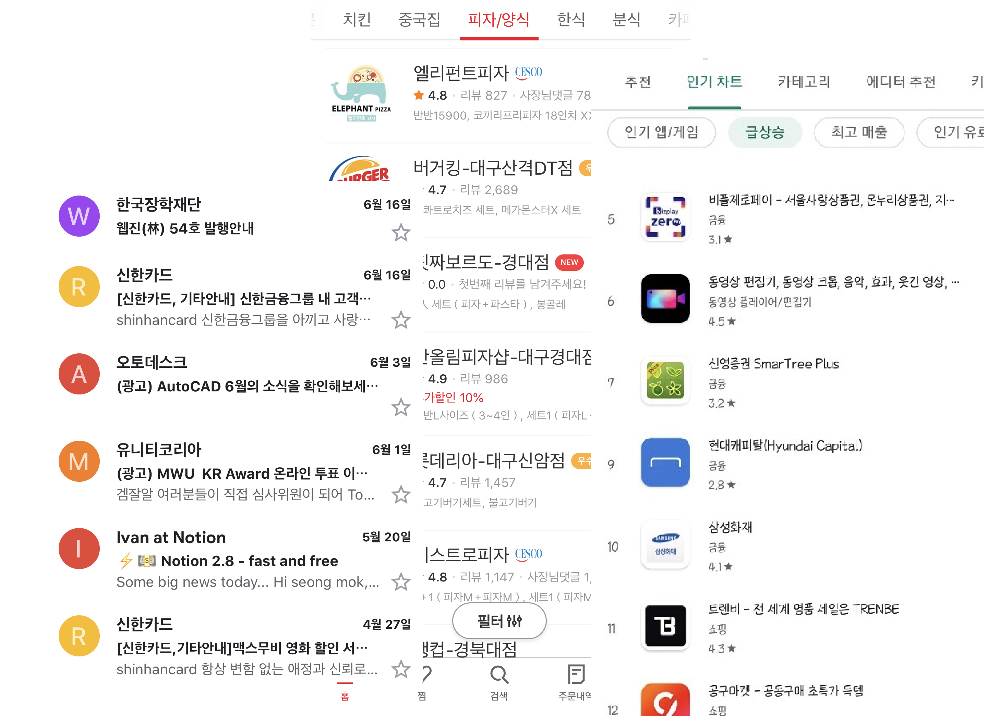
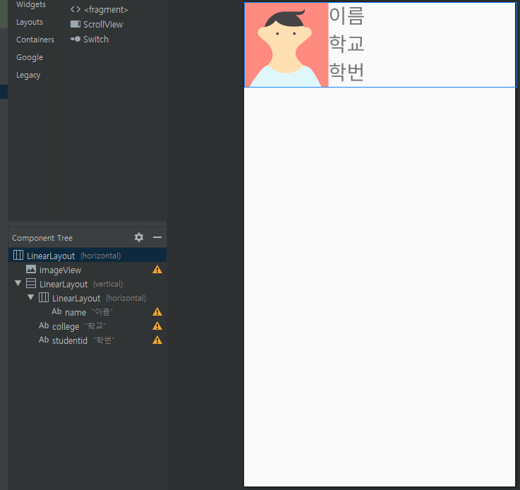
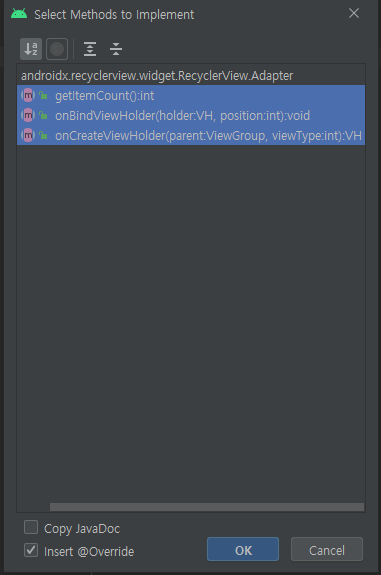
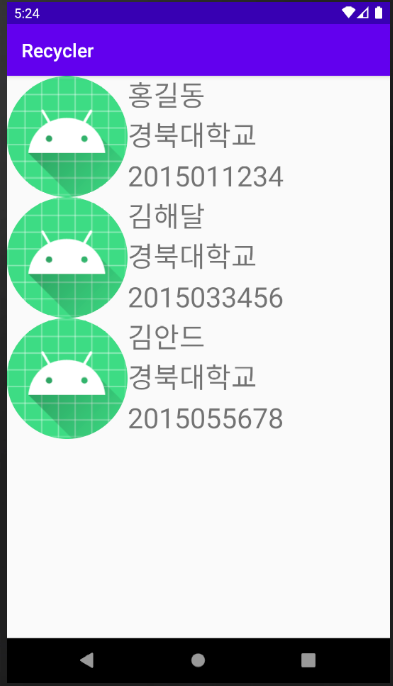

### 리싸이클러뷰(RecyclerView)

> **RecyclerView** 위젯은 ListView가 더 진보하고 유연해진 버전입니다. [-안드로이드 공식문서](https://developer.android.com/guide/topics/ui/layout/recyclerview?hl=ko)

휴대폰을 사용하다 보면, 메일함이나 배달앱, 플레이스토어 등등 여러 항목들을 **리스트** 형태로 나열한 화면의 앱들을 많이 볼수있다. 터치를 이용하는 모바일 기기의 특성 상 사용자가 쉽고 직관적으로 여러 항목을 보고 선택해야 하기 때문이다.

 


위와 같은 리스트 화면을 구성할 때, 예전에는 `ListView`를 많이 사용하였으나, `ListView`의 대부분의 기능들을 `RecyclerView`로 할 수 있고, 좀 더 유연한 레이아웃을 구성할수 있기때문에, `RecyclerVIew`를 많이 사용한다.

리스트 화면은 **뷰홀더(ViewHolder)** 객체로 표현한다. 뷰홀더는 뷰를 사용하여 단일 아이템을 표시하는 역할을 한다. 위의 화면을 예로들면 메일함에서는 메일 한통, 플레이스토어에서는 어플리케이션 하나를 표시하는 화면을 뷰홀더 라고 할수있다.

뷰홀더 객체는 **어댑터(Adapter)** 에서 관리한다. 어댑터는 사용자 데이터 리스트로부터 아이템을 만든다.

### 리싸이클러뷰 만들기

학생들의 이름과 학번을 관리하는 리싸이클러뷰

어댑터 안에 들어갈 아이템의 데이터를 담아둘 클래스를 `/app/java/org.프로젝트` 폴더에 생성해준다.

생성자와 get(), set() 메소드를 생성할때는 오른쪽 클릭후 `Generate` 또는 `Alt` + `Insert`
```java
// app/java/org.hong.recycler/Student.java
Package org.hong.recycler;

public class Student {
    String name;
    String college;
    int studentID;
    
    public Student(String name, String college, int studentID) {
        this.name = name;
        this.college = college;
        this.studentID = studentID; 
    }
    public void setName(String name) { this.name = name; }
    public void setCollege(String college) { this.college = college; }
    public void setStudentID(int studentID) { this.studentID = studentID; }
    
    public String getName() { return name; }
    public String getCollege() { return college; }
    public int getStudentID() { return studentID; }
}
```

그다음, 각 아이템을 위한 XML 레이아웃 `student_item.xml` 파일을 `/res/layout`폴더에 만들어줍니다.

```xml<?xml version="1.0" encoding="utf-8"?>
<LinearLayout xmlns:android="http://schemas.android.com/apk/res/android"
    xmlns:app="http://schemas.android.com/apk/res-auto"
    xmlns:tools="http://schemas.android.com/tools"
    android:layout_width="match_parent"
    android:layout_height="wrap_content"
    android:orientation="horizontal">

    <ImageView
        android:id="@+id/imageView"
        android:layout_width="130dp"
        android:layout_height="130dp"
        app:srcCompat="@mipmap/ic_launcher" />

    <LinearLayout
        android:layout_width="match_parent"
        android:layout_height="match_parent"
        android:orientation="vertical">

        <LinearLayout
            android:layout_width="match_parent"
            android:layout_height="wrap_content"
            android:layout_weight="1"
            android:orientation="horizontal">

            <TextView
                android:id="@+id/name"
                android:layout_width="match_parent"
                android:layout_height="wrap_content"
                android:text="이름"
                android:textSize="30sp" />
        </LinearLayout>

        <TextView
            android:id="@+id/college"
            android:layout_width="match_parent"
            android:layout_height="wrap_content"
            android:layout_weight="1"
            android:text="학교"
            android:textSize="30sp" />

        <TextView
            android:id="@+id/studentid"
            android:layout_width="match_parent"
            android:layout_height="wrap_content"
            android:layout_weight="1"
            android:text="학번"
            android:textSize="30sp" />
    </LinearLayout>

</LinearLayout>
```




그다음에 `StudentAdapter.java` 파일을 생성해주고, 먼저 ViewHolder 클래스를 static으로 정의해준다.

```java
// app/java/org.hong.recycler/StudetAdapter.java
package org.hong.recycler;

import android.view.View;
import android.widget.TextView;

import androidx.recyclerview.widget.RecyclerView;

public class StudentAdapter extends RecyclerView.Adapter<StudentAdapter.ViewHolder>{
    static class ViewHolder extends RecyclerView.ViewHolder {
        TextView name;
        TextView college;
        TextView studentId;

        public ViewHolder(View itemView) {
            super(itemView);

            name = itemView.findViewById(R.id.name);
            college = itemView.findViewById(R.id.college);
            studentId = itemView.findViewById(R.id.studentid);
        }

        public void setItem(Student item){
            name.setText(item.getName());
            college.setText(item.getCollege());
            studentId.setText(item.getStudentID());
        }

    }
}
```

ViewHolder 클래스를 생성해주고, `findviewById()` 메소드를 통해 텍스트뷰를 참조해준다. `setItem()` 메소드는 뷰홀더에 있는 뷰 객체의 텍스트뷰들의 글자를 학생 데이터로 설정해준다.

코드를 작성하고나면 `public class StudentAdapter extends RecyclerView.Adapter<StudentAdapter.ViewHolder>` 부분에서 에러가 나는것을 확인할 수 있다.
코드 위에서 `Alt` + `Enter`를 누르고 `Implement method`를 선택해준다.

 

그림과 같은 화면이 나타나면 세개 다 선택 후에 OK버튼을 눌러주면 된다.

- `getItemCount()` : 어댑터가 관리하는 아이템 개수를 반환
- `onCreateViewHolder()` : 뷰홀더 객체가 만들어질 때 자동으로 호출
- `onBindViewHolder()` : 뷰홀더 객체가 재사용될 때 자동으로 호출

세개의 메소드가 추가되면, 다음과 같이 코드를 작성하면된다.

```java
public class StudentAdapter extends RecyclerView.Adapter<StudentAdapter.ViewHolder>{
    ArrayList<Student> items = new ArrayList<Student>();

    @NonNull
    @Override
    public ViewHolder onCreateViewHolder(@NonNull ViewGroup viewGroup, int viewType) {
        LayoutInflater inflater = LayoutInflater.from(viewGroup.getContext());
        View itemView = inflater.inflate(R.layout.student_item, viewGroup, false);

        return new ViewHolder(itemView);
    }

    @Override
    public void onBindViewHolder(@NonNull ViewHolder holder, int position) {
        Student item = items.get(position);
        holder.setItem(item);
    }
    @Override
    public int getItemCount() { return items.size(); }

...

```

어댑터에 **Student** 객체를 넣거나 가져갈 수 있도록 `addItem()`, `setItems()`, `getItem()`, `setItem()` 메소드를 추가해준다.

```java
public class StudentAdapter extends RecyclerView.Adapter<StudentAdapter.ViewHolder>{
...
    public void addItem(Student item) { items.add(item); }
    public void setItems(ArrayList<Student> items) { this.items = items; }
    public Student getItem(int position) { return items.get(position); }
    public void setItem(int position, Student item) { items.set(position, item); }
...
}

```


마지막으로 `MainActivity.java` 파일에 학생들을 추가해서 넣어주면 된다.

```java

package org.hong.recycler;

import ...

public class MainActivity extends AppCompatActivity {

    LinearLayoutManager layoutManager;
    RecyclerView recyclerView;
    StudentAdapter adapter;

    @Override
    protected void onCreate(Bundle savedInstanceState) {
        super.onCreate(savedInstanceState);
        setContentView(R.layout.activity_main);

        recyclerView = findViewById(R.id.recyclerView);

        layoutManager = new LinearLayoutManager(this, LinearLayoutManager.VERTICAL, false);
        recyclerView.setLayoutManager(layoutManager);
        adapter = new StudentAdapter();


        adapter.addItem(new Student("홍길동", "경북대학교", "2015011234"));
        adapter.addItem(new Student("김해달", "경북대학교", "2015033456"));
        adapter.addItem(new Student("김안드", "경북대학교", "2015055678"));
        recyclerView.setAdapter(adapter);

    }
}

```

### 완성

