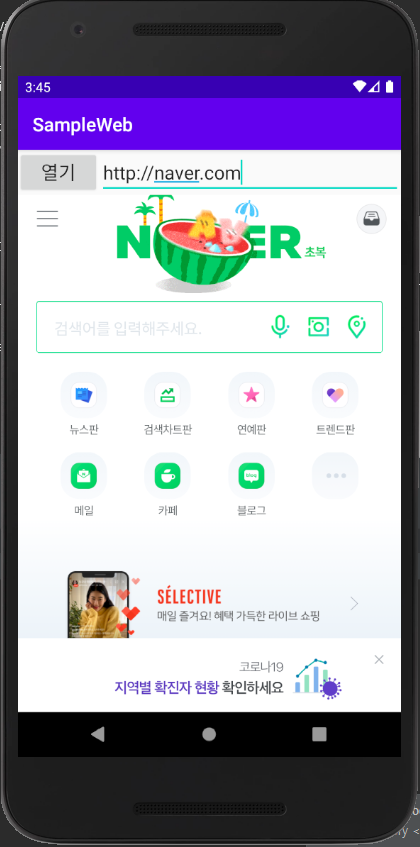

### 앱 화면에 웹브라우저 추가

웹브라우저를 앱 안에 넣을 때는 **웹뷰(WebView)** 를 사용하면 된다.

웹뷰를 사용할 때는 인터넷에 접속하게 되기 때문에, 매니페스트에 인터넷 접속 권한이 등록되어 있어야 한다.
<br> `AndroidManifest.xml` 파일을 열어 접속권한을 추가해주면 된다.

```xml
<manifest xmlns:android="http://schemas.android.com/apk/res/android"
    package="org.hong.sampleweb">

    <uses-permission android:name="android.permission.INTERNET"/>

    <application
        android:usesCleartextTraffic="true"
    ...
</manifest>
```

그다음에 `activity_main.xml` 파일을 열어 `<WebView>` 태그를 추가해주고, 주소입력을 위한 `EditText`와 `Button`을 추가해주었다 

```xml

<LinearLayout xmlns:android="http://schemas.android.com/apk/res/android"
    xmlns:app="http://schemas.android.com/apk/res-auto"
    xmlns:tools="http://schemas.android.com/tools"
    android:layout_width="match_parent"
    android:layout_height="match_parent"
    android:orientation="vertical"
    tools:context=".MainActivity" >

    <LinearLayout
        android:layout_width="match_parent"
        android:layout_height="wrap_content"
        android:orientation="horizontal">

        <Button
            android:id="@+id/button"
            android:layout_width="wrap_content"
            android:layout_height="wrap_content"
            android:text="열기"
            android:padding="4dp"
            android:textSize="20sp"
            />
        <EditText
            android:id="@+id/editText"
            android:layout_width="match_parent"
            android:layout_height="wrap_content"
            android:textSize="20sp"
            />
    </LinearLayout>
    <WebView
        android:id="@+id/webView"
        android:layout_width="match_parent"
        android:layout_height="match_parent"
        />
</LinearLayout>

```

`MainActivity.java` 파일을 열어 코드를 추가해준다.

```java

public class MainActivity extends AppCompatActivity {
    EditText editText;
    WebView webView;

    @Override
    protected void onCreate(Bundle savedInstanceState) {
        super.onCreate(savedInstanceState);
        setContentView(R.layout.activity_main);

        editText = findViewById(R.id.editText);
        webView = findViewById(R.id.webView);

        WebSettings webSettings = webView.getSettings();
        webSettings.setJavaScriptEnabled(true);

        webView.setWebViewClient(new WebViewClient());

        Button button = findViewById(R.id.button);
        button.setOnClickListener(new View.OnClickListener(){
            @Override
            public void onClick(View view) {
                webView.loadUrl(editText.getText().toString());
            }
        });
    }

    private class ViewClient extends WebViewClient {
        @Override
        public boolean shouldOverrideUrlLoading(final WebView view, final String url) {
            view.loadUrl(url);

            return true;
        }
    }
}

```


### 완성

