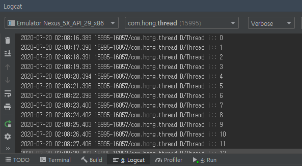
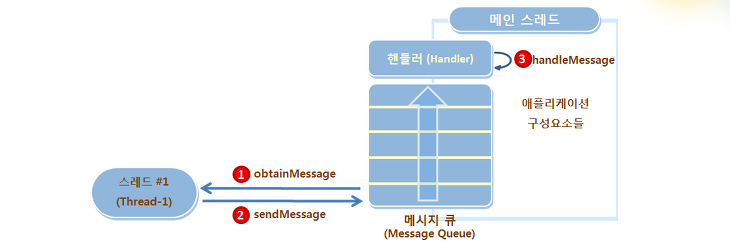
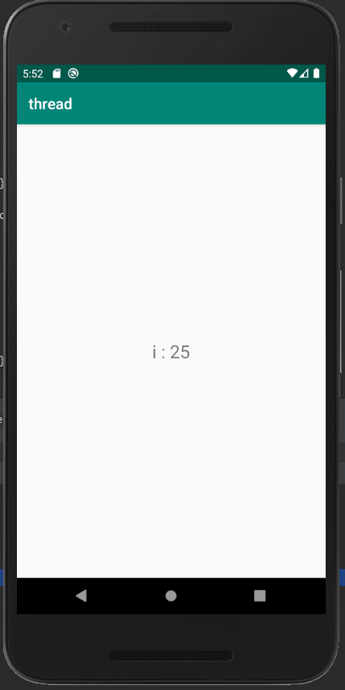

### 스레드(Thread), 핸들러(Handler)

#### 스레드(Thread)란?

스레드는 하나의 프로세스 안에서 동시에 수행되어야 하는 작업을 위해 사용한다. 스레드를 설명할때 가장 좋은 예시는 요리할 때와 비슷하다고 할 수 있다.
> 요리를 할 때, 밥솥의 취사버튼을 누르고 다 될때까지 기다렸다가 찌개를 끓이고, 또 찌개가 다 될때까지 기다렸다가 반찬을 만들고 하지는 않는다. 밥솥에 밥을 올려놓고, 찌개를 끓이면서 동시에 다른 반찬들을 만들고는 한다.  

이처럼 하나의 프로세스 안에서 여러 개의 작업을 동시에 처리하는 방식을 **멀티스레드 방식**이라고 하고, 여기서 동시 수행이 가능한 작업 단위를 **스레드(Thread)**라고 한다.
<br>만약 멀티스레드 방식이 아닌 메인 스레드 하나만으로 앱을 만들게 되면, 대기시간이 길어지는 작업을 할때 그 일이 마칠때까지 멈춰있는 화면을 보게되는 문제가 생길 수 있다.

스레드 클래스는 다음과 같이 만들 수 있다.
```java
class Thread1 extends Thread {

        public void run() {
            //실행 내용
        }
    }
```

스레드 객체 생성은 다음과 같이 할수있다.
```java
Thread1 thread = new Thread1();
```

객체를 만든 후 스레드를 시작시키기 위해서는 `start()` 메소드를 이용하면 된다.
```java
thread.start();
```

스레드를 사용한 예제
```java
public class MainActivity extends AppCompatActivity {
    @Override
    protected void onCreate(Bundle savedInstanceState) {
        super.onCreate(savedInstanceState);
        setContentView(R.layout.activity_main);

        Thread1 thread = new Thread1();
        thread.start();
    }

    class Thread1 extends Thread {
        public void run() {
            for(int i = 0; i < 100; i++) {
                try { Thread.sleep(1000); }
                catch(Exception e) { }
                Log.d("Thread i: ", "" + i);
            }
        }
    }
}
```
실행결과 Logcat 창에 i 값이 1씩 추가되서 출력되는것을 볼 수 있다.



#### 핸들러(Handler)

동시에 여러 스레드에서 UI 작업을 하려고 하면 충돌이 발생하기 때문에 안드로이드는 기본적으로 실행시 생성되는 메인 스레드를 통해서만 화면 UI를 변경할 수 있다.
<br>다른 스레드에서 처리할 메세지들을 저장하기 위해서는 **메세지 큐(Message Queue)** 를 이용하는데, 메세지 큐를 사용하여 작업을 순차적으로 처리할 수 있다. 이때, 메세지 큐로 메인스레드에서 처리할 메세지를 전달하는 역할을 하는 것이 **핸들러(Handler)** 이다.

<!--
핸들러의 메세지 처리 방법을 그림으로 표현하면 다음과 같다.

-->

```java

public class MainActivity extends AppCompatActivity {

    TextView textView;
    Handler2 handler;

    @Override
    protected void onCreate(Bundle savedInstanceState) {
        super.onCreate(savedInstanceState);
        setContentView(R.layout.activity_main);

        textView = findViewById(R.id.textView);

        Thread2 thread = new Thread2();
        thread.start();

        handler = new Handler2();
    }

    class Thread2 extends Thread {
        int i;
        public void run() {
            for(i = 0; i < 100; i++) {
                try { Thread.sleep(1000); }
                catch(Exception e) { }
                Log.d("Thread i: ", "" + i);

                Message message = handler.obtainMessage();
                Bundle bundle = new Bundle();
                bundle.putInt("i", i);
                message.setData(bundle);

                handler.sendMessage(message);
            }
        }
    }

    class Handler2 extends Handler {
        @Override
        public void handleMessage(@NonNull Message msg) {
            super.handleMessage(msg);

            Bundle bundle = msg.getData();
            int i = bundle.getInt("i");
            textView.setText("i : " + i);
        }
    }
}
```
실행화면




### Runnable 객체 실행

핸들러 클래스는 메세지 전송 방법 이외에 **Runnable** 객체를 실행시킬 수 있다.
<br>Runnable 객체를 Handler의 `post()` 메소드로 전달해주면 된다.
<br>다음은 바로 위의 예제를 Runnable 객체를 통하여 구현한 코드이다.
```java

public class MainActivity extends AppCompatActivity {

    TextView textView;
    Handler handler = new Handler();

    @Override
    protected void onCreate(Bundle savedInstanceState) {
        super.onCreate(savedInstanceState);
        setContentView(R.layout.activity_main);

        textView = findViewById(R.id.textView);

        Thread2 thread = new Thread2();
        thread.start();
    }

    class Thread2 extends Thread {
        int i;
        public void run() {
            for(i = 0; i < 100; i++) {
                try { Thread.sleep(1000); }
                catch(Exception e) { }
                Log.d("Thread i: ", "" + i);

                handler.post(new Runnable() {
                    @Override
                    public void run() {
                        textView.setText("i : " + i);
                    }
                });
            }
        }
    }
}
```

Runnable 객체를 이용하여 코드를 작성하여 훨씬 간단하게 구현할 수 있다.