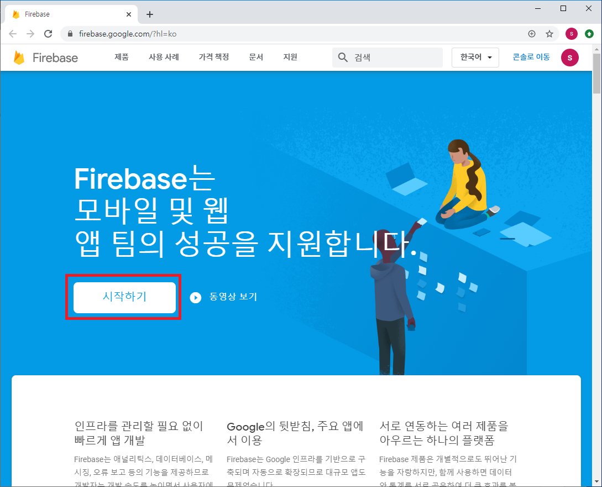
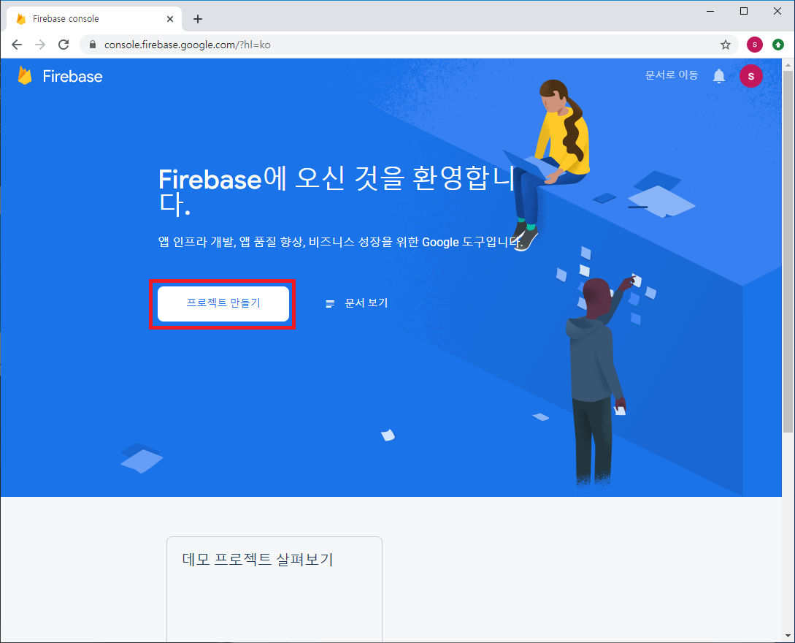
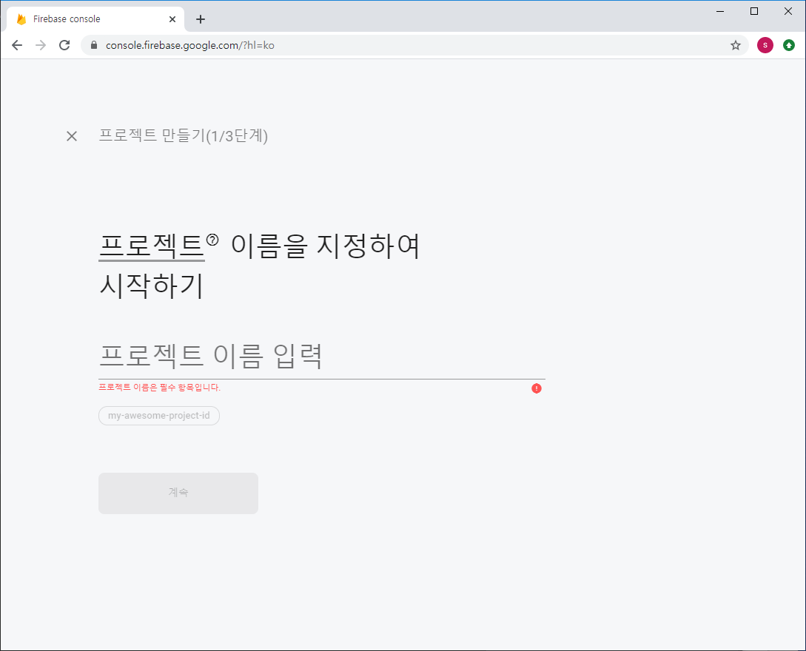
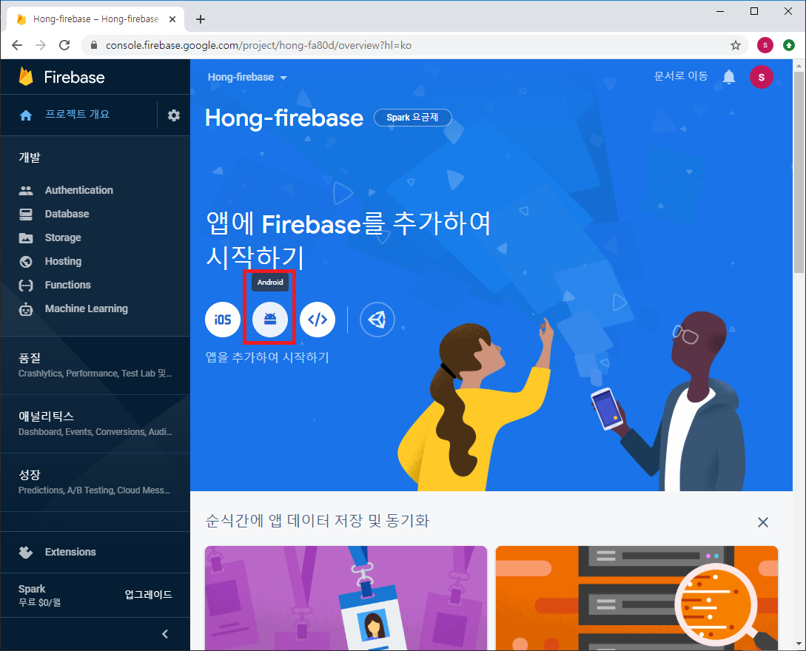
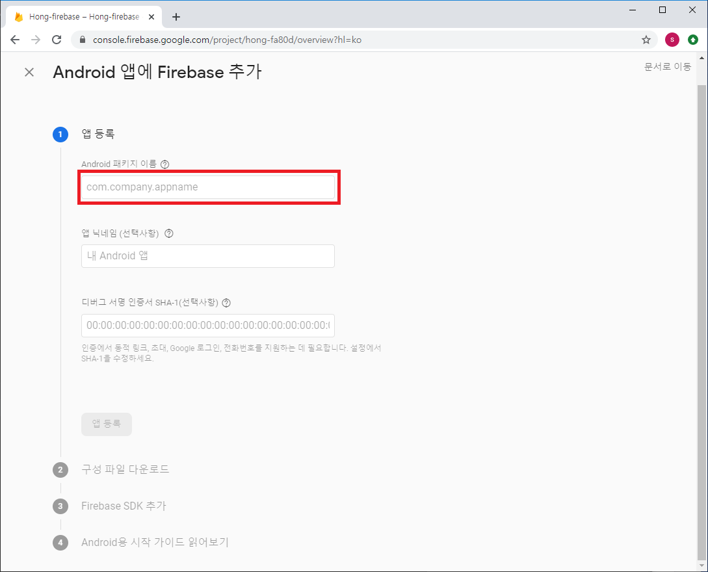
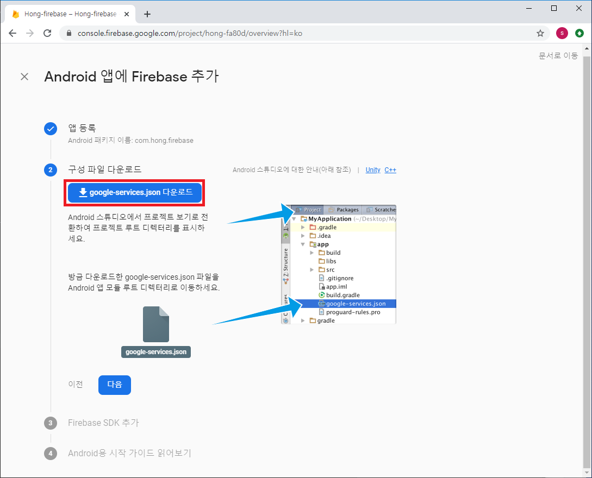
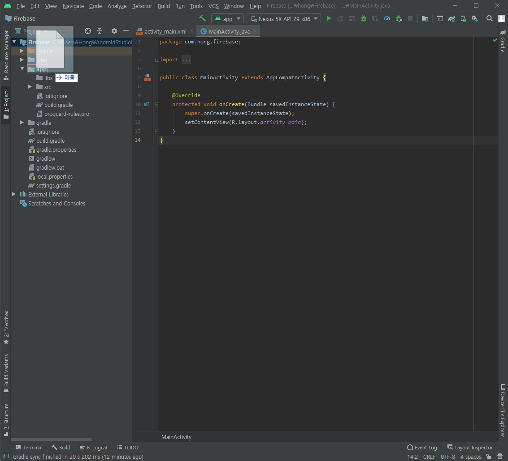
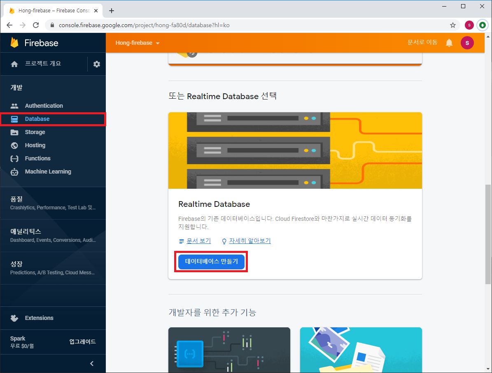
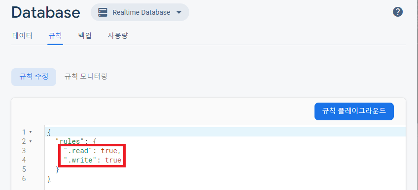
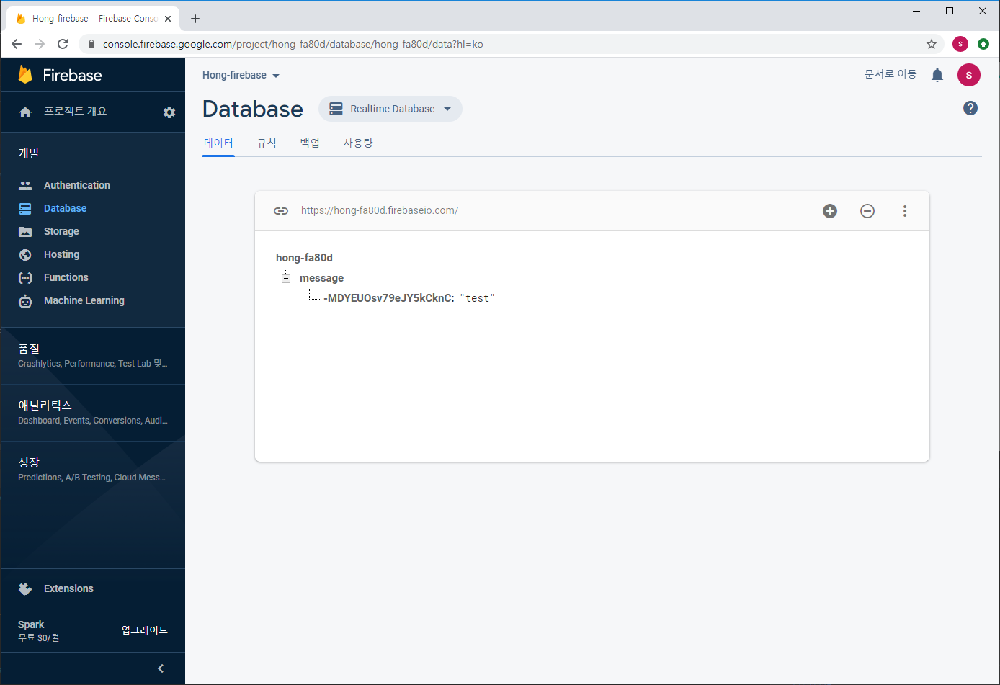

### 안드로이드 앱에 파이어베이스(Firebase) 연결하기

Firebase 홈페이지 접속하기
<br>[https://firebase.google.com/?hl=ko](https://firebase.google.com/?hl=ko)

프로젝트 만들기




프로젝트 이름을 입력하고 버튼을 누르다 보면 프로젝트가 시작된다.



만든 프로젝트의 화면이 뜨면 밑의 사진처럼 안드로이드 버튼을 클릭한다.


Android 앱에 Firebase 추가 화면이 뜨면 내가 만든 Android 패키지 이름을 입력한다. 나머지 칸은 비워도 괜찮다.


`google-services.json 다운로드` 버튼을 클릭하고, 안드로이드 프로젝트 폴더의 `app` 폴더에 파일을 넣는다.




그다음 어플리케이션에 인터넷 사용권한을 부여해야 한다.
<br>`AndroidManifest.xml`에 `<uses-permission android:name="android.permission.INTERNET" />` 코드를 추가해준다.
<br><br>

그다음 개발->Database 탭으로 들어가서 `Realtime Database`를 생성한다.  



데이터베이스를 생성한 후, 규칙탭에서 규칙을 수정할 수 있는데, 테스트를 위해서 읽기와 쓰기를 모두 허용시킨다. 



이제 어플리케이션에서 데이터가 잘 전송되는지 확인한다. `activity_main.xml` 파일에 `EditText`와 `Button` 하나를 추가한 후, `MainActivity.java`파일에 코드를 작성한다.

 ```java
public class MainActivity extends AppCompatActivity {
    EditText editText;
    Button button;

    String text;

    FirebaseDatabase firebaseDatabase = FirebaseDatabase.getInstance();
    DatabaseReference databaseReference = firebaseDatabase.getReference();

    @Override
    protected void onCreate(Bundle savedInstanceState) {
        super.onCreate(savedInstanceState);
        setContentView(R.layout.activity_main);

        editText = findViewById(R.id.editText);
        button = findViewById(R.id.button);

        button.setOnClickListener(new View.OnClickListener(){
            @Override
            public void onClick(View view) {
                text = editText.getText().toString();
                databaseReference.child("message").push().setValue(text); // EditText에 입력된 데이터 전송
            }
        });
    }
}
```

앱을 실행하고 텍스트를 입력하고 전송버튼을 누르면 데이터가 전송이 된다.





